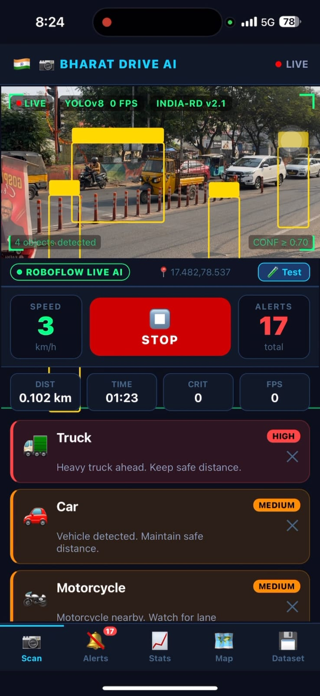

# 🚗 BharatDriveAI

AI-powered roadside driving behavior detection system for Indian roads using Computer Vision and YOLO.

## Overview
BharatDriveAI is an AI-powered roadside driving behavior detection system designed to improve Indian road safety using computer vision and real-time monitoring.

## Features
- Real-time roadside behavior detection
- Pedestrian & Vulnerable Road User (VRU) detection
- Lane behavior analysis
- Smart alert system
- Camera integration
- Map-based monitoring dashboard

## Tech Stack
- React Native
- JavaScript
- Python
- YOLO
- Computer Vision

## Project Structure
src/
├── screens/
├── components/
├── hooks/
├── utils/

## Current Status

✅ Mobile UI completed

✅ Detection dashboard implemented

✅ YOLO integration prototype completed

🔄 Performance optimization in progress

🔄 Advanced analytics under development

## Future Improvements
- Live CCTV integration
- Improved YOLO model accuracy
- Cloud-based analytics
- Accident prediction system

## Demo

The application provides:

- Real-time roadside monitoring
- YOLO-based object detection
- Vulnerable Road User (VRU) detection
- Safety alerts
- Traffic analytics dashboard

  
## Screenshots

### Home Screen

### Detection Screen

### Detection Results

### Statistics Dashboard

